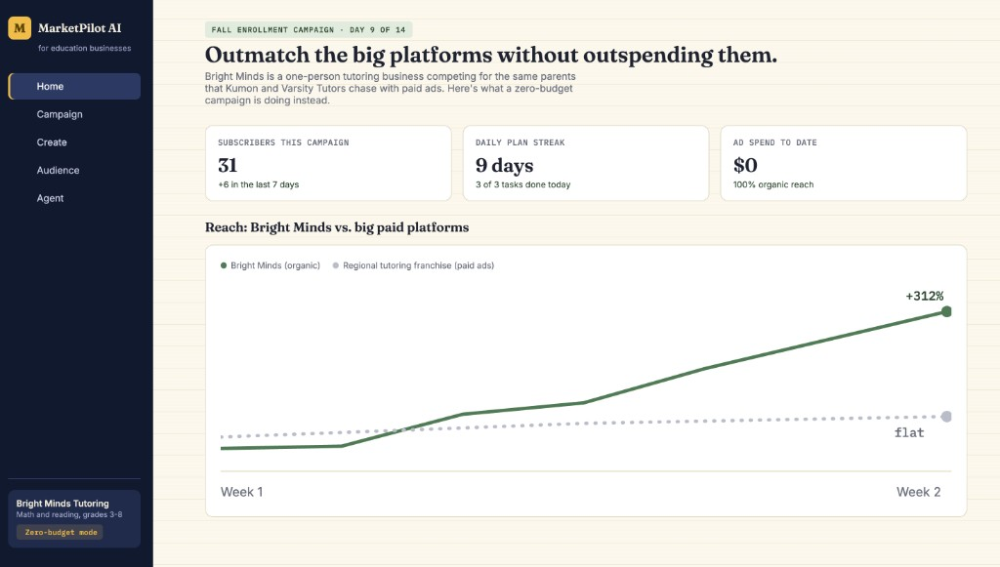

# MarketPilot AI

## Problem

Many entrepreneurs, startups, and small business owners struggle to market their products because they lack marketing experience, time, or the budget to hire professionals. They often don't know which marketing channels to use, what messaging will resonate with customers, or how to launch an effective campaign. Existing marketing tools often overwhelm users with too many choices and require marketing knowledge they don't have.

## Solution

MarketPilot AI is an AI-powered digital marketing assistant that acts as a personal marketing strategist for beginners.

Instead of asking users to choose between dozens of marketing options, MarketPilot AI recommends one complete campaign tailored to the user's business goals. Using its built-in CampaignTwin intelligence, the app simulates customer reactions before launch, generates only the marketing assets needed for the campaign, and provides a simple daily action plan to help users execute successfully.

This enables entrepreneurs, startups, and small businesses to launch effective marketing campaigns without needing prior marketing experience.

## Features

- AI-powered campaign recommendations
- Personalized onboarding questionnaire
- CampaignTwin customer reaction simulation
- Marketing content generation
- Campaign approval workflow
- Daily marketing task planner
- Progress dashboard

## Tech Stack

Frontend
- HTML5
- CSS3
- JavaScript

Deployment
- GitHub Pages

## Screenshot

